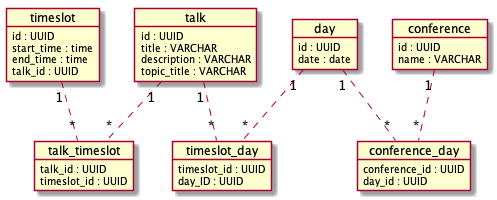
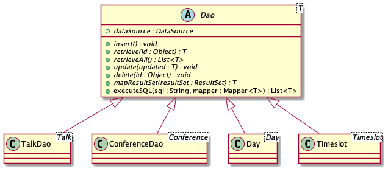
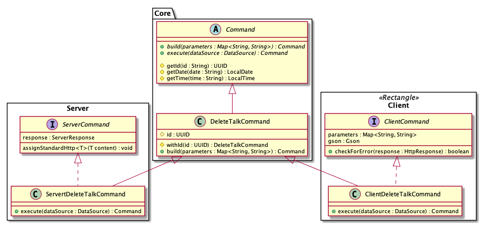
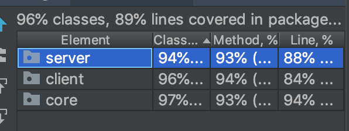

[](https://travis-ci.com/Westerdals/pgr200-eksamen-tordjon)

# Dokumentasjon 
Olav Sundfør - sunola17 <br>
Tord Jon - jontor17 <br>

- [Dokumentasjon](#dokumentasjon)
    - [Testing av program](#testing-av-program)
    - [Brukermanual](#brukermanual)
        - [Om programmet](#om-programmet)
        - [Vise programoversikt](#vise-programoversikt)
        - [Legge inn data](#legge-inn-data)
        - [Liste ut data](#liste-ut-data)
        - [Koble sammen data](#koble-sammen-data)
        - [Sletting](#sletting)
        - [Oppdatering](#oppdatering)
    - [Diagrammer](#diagrammer)
        - [Datamodell](#datamodell)
        - [DAO](#dao)
        - [Command](#command)
    - [Video](#video)
    - [Evaluering](#evaluering)
        - [Mottatt evaluering](#mottatt-evaluering)
        - [Sendt evaluering](#sendt-evaluering)
        - [Evaluering av samarbeid](#evaluering-av-samarbeid)
        - [Egenevaluering](#egenevaluering)


## Testing av program 
1. Kjør kommandoer fra prosjektets rotmappe.
2. Konfigurer database basert på `./innlevering.properties`
3. Kjør `mvn install` i prosjektets rotmappe
4. Start server 
    1. `java -jar server/target/server.jar` 
5. Kjør demo i klient 
    1. Uten shell
        1. `java -jar client/target/client.jar create demo`
        2. Kopier ID som blir listet ut (evt. kjør med `list conferences`)
        3. `java -jar client/target/client.jar show schedule -id *ID*`
    2. Med shell 
        1. `java -jar client/target/client.jar shell`
        2. `create demo`
        3. Kopier ID som blir listet ut (evt. kjør med `list conferences`)
        4. `show schedule -id *ID*`

Full oversikt over funksjonalitet finnes under "Brukermanual."


## Brukermanual

### Om programmet 
Programmet vi har laget, lar brukeren holde orden på konferanser i en database. 
En konferanse ("conference") foregår over en eller flere dager. En dag ("day") kan ha 
flere tidsperioder ("timeslot").
På hver tidsperiode kan det være en eller flere foredrag ("talk"). 

Data (konferanser, foredrag, dager, tidsperioder) legges inn av brukeren. 
De kan så kobles sammen slik brukeren ønsker. Beskrivelse av hvordan dette gjøres, finnes 
nedenfor, i denne seksjonen av dokumentet. 

### Vise programoversikt 
Viser et programmet for en hel konferanse, med alle relevante detaljer: 
`show schedule -id ID`, hvor ID kan finnes ved å kjøre `list conferences`'. ID er påkrevd. 

### Legge inn data
* Talk
    * `insert talk -title Java honey jars -description Really important talk! -topic java`
    * `insert talk`
        * `-title` __required__
        * `-description `
        * `-topic`
* Conference 
    * `insert conference -name The Book Conference` 
    * `insert conference`
        * `-name` __required__
* Day (DD.MM.YYYY)
    * `insert day -date 18.04.1999`
    * `insert day`
        * `-date` __required__
* Timeslot (HH:MM)
    * `insert timeslot -start 14:30 -end 15:45`
    * `insert timeslot`
        * `-start` __required__
        * `-end` __required__

### Liste ut data 
* `list talks`
* `list conferences`
* `list days`
* `list timeslots`

### Koble sammen data 
* Day og conference 
    * `connect day-with-conference -day DAYID -conference CONFERENCEID`
    * `connect day-with-conference`
        * `-day` __required__
        * `-conference` __required__
* Timeslot og Day 
    * `connect timeslot-with-day -timeslot TIMESLOTID -day DAYID`
    * `connect timeslot-with-day`
        * `-timeslot` __required__ 
        * `-day` __required__
* Talk og Timeslot 
    * `connect talk-with-timeslot -talk DAYID -timeslot CONFERENCEID`
    * `connect talk-with-timeslot`
        * `-talk` __required__ 
        * `-timeslot` __required__

### Sletting 
Kjør `delete`, det du vil slette og en ID. 
Du kan finne ID ved å kjøre `list`-kommandoen. 
* `delete talk -id ID`
* `delete conference -id ID`
* `delete day -id ID`
* `delete timeslot -id ID`

### Oppdatering 
* Talk
    * `udpate talk -title I had to update this -id ID`
    * `update talk`
        * `-id` __required__
        * `-title`
        * `-description `
        * `-topic`
* Conference 
    * `update conference -id ID -name Edited talk title` 
    * `update conference`
        * `-id` __required__
        * `-name`
* Day (DD.MM.YYYY)
    * `update day -date 18.04.1999`
    * `update day`
        * `-id` __required__
        * `-date`
* Timeslot (HH:MM)
    * `update timeslot -start 14:30 -end 15:45`
    * `update timeslot`
        * `-id` __required__
        * `-start`
        * `-end`


## Diagrammer 
### Datamodell


Datamodellen vår fungerer slik: <br> 
Systemet vårt skal holde rede på konferanser. Hver konferanse kan gå over ingen eller mange dager, gjennom en koblingstabell. Vi ønsker å tillate ingen dager fordi at man skal kunne registrere konferanser som enda ikke har fått datoer.

En dag har flere tidsrom ("timeslots") hvor man potensielt kan legge inn et foredrag. 

Hver tabell inneholder kun refereanser til de andre. Ingen informasjon er gjentatt og databasen er svært [normalisert](https://en.wikipedia.org/wiki/Database_normalization). 

Når våre DAO-objekter skal hente data ut fra en tabell, kan de gjøre oppslag mot dataen det refereres til. Altså: <br>
Når vi henter ut en konferanse, kan vi gjøre et nytt oppslag mot konferanse-tabellen. 
Deretter kan vi bruke ID fra conerence til å finne riktige dager i "conference_day"-tabellen.  

### DAO


Vi har ønsket å vite at alle DAO-klasser har mulighet til å gjøre alle CRUD-operasjoner. Det de derfor har til felles er metodesignaturer (med genererisk spesifisering) og mulighet til å kjøre SQL. 

De forskjellige implementasjonene arver fra den abstrakte klassen, og implementerer metodene. 

`executeSQL` er ikke abstrakt i `Dao`, og er implementert slik at koden i de konkrete klassene kan bli slik som dette: 
```java 
@Override
public List<Talk> retrieveAll() throws SQLException {
    String sql = "select id, title, description, topic_title from talk";
    List<Talk> results = executeSQL(sql, this::mapResultSet);

    return results;
}
``` 

`mapResultSet` er en metode som tar i mot resultatet fra en spørring og transformerer ("mapper") det til et objekt av typen vi er interessert i.
```java 
@Override
protected Talk mapResultSet(ResultSet resultSet) throws SQLException {

        Talk talk = new Talk(
                (UUID) resultSet.getObject(1),
                resultSet.getString(2),
                resultSet.getString(3),
                resultSet.getString(4)
        );

    return talk;
}
```

Notis: De konkrete klassenes generics er ment å vise: `class TalkDao extends Command<Talk>`

### Command

Kommandoer ("Commands") spiller en stor rolle i vår struktur. En kommando er en handling som programmet gjør, basert på et input. Et eksempel på en kommando er `InsertTalkCommand`. Den har som oppgave å legge inn et foredrag ("talk") i databasen. 

Kommandoer som denne har to sider:

1. Bruker forteller klienten at dette skal skje
2. Server mottar forespørsel fra klient og utfører den faktiske operasjonen

Denne egenskapen (med to sider) gjelder alle kommandoer i programmet vårt. Derfor har alle kommandoer et felles sett med  abstrakte "base"-klasser i `Core`-modulen. 
`Server`- og `Client`-modulene har konkrete implementasjoner av disse. (f.eks. `ServerDeleteTalkCommand`og `ClientDeleteTalkCommand`)

Diagrammet viser strukturen for kommandoen som skal slette talks, men den samme strukturen gjenbrukes for alle kommandoer. 

Både på server- og klientside skal denne kommandoen opere med ID. De to skal altså bygges med de samme verdiene, og har en felles `build`-metode som arves fra Core. De skiller seg derimot i hva de skal _gjøre_. Derfor har de forskjellige `execute`-implementasjoner i Server og Client. 

Noe funksjonalitet gjelder for alle kommandoer på server, og kun disse.
Det samme gjelder funksjonalitet for kommandoer i klienten. 

Den funksjonaliteten hentes inn med de to interfacene. 

Vi har valgt å gjøre dette til interface fordi det kun er mulig å arve fra en klasse. Vi ønsket å arve fra både (i `ServerDeleteTalkCommand` sitt tilfelle) `ServerCommand`og `DeleteTalkCommand`. 


## [Video](https://www.youtube.com/watch?v=3axZ6puyq0s&feature=youtu.be)


## Evaluering 

### Mottatt evaluering 
Ikke mottatt per 13:00 11.11.18

### Sendt evaluering
(Vurdert 10.11.18)
Positivt: 
* `mvn install`kjører knirkefritt, med grønne tester 
* Testdekningen er forholdsvis god 
* Koden er ryddig skrevet 
* Koden er stort sett lett å lese 

Problemer: 
* Vi klarer ikke å kjøre server, får error: `no main manifest attribute`
* Server kjører ikke, og kommandoer printer stackTrace til bruker 
* Vi er usikre på avhengigheten mellom server og client

Forslag til forbedring: 
* Readme er vanskelig å lese
* Noen metoder og felter brukes aldri (IDE gjør dem grå). De bør enten brukes eller fjernes 


### Evaluering av samarbeid 
Vi har stort sett jobbet sammen, ofte på en maskin. Når vi ikke har gjort det, har vi jobbet over nett, med Git og samtaleverktøy som voicechats i Slack og Discord. Vi har også delt skjerm gjennom disse tjenestene og på den måten fått gjort en slags form for parprogrammering når vi har sett behov for det.

Hva selve samarbeidet angår, finner vi ofte gode løsninger. Det er ikke alltid vi er enige, men vi opplever at samtalen er konstruktiv, heller enn å være en konflikt. Vi har jevnt over funnet en god løsning som begge kan si seg fornøyde med, til tross for at ikke alle elementer er slik som hver av oss opprinnelig hadde sett for seg.

Vårt prosjekt har brukt noe av logikken fra tidligere arbeidskrav. Det gikk lettere å slå sammen de to prosjektene denne gangen, siden vi hadde gjort det tidligere. Vi tok plugins som _maven-shade-plugin_ og _jacoco_ med oss fra tidligere arbeidskrav. Under oppsettet av dette prosjektet kom nytten av å ha gjort det samme tidligere tydelig frem. 

I arbeidskrav 2 skrev vi at vi hadde et forbedringspotensiale på det å sette konkrete mål for hva som skal gjøres, fremfor å jobbe sporadisk og hoppe mellom arbeidsoppgaver. Her har vi blitt flinkere. 
En teknikk vi har brukt er å sette opp konkrete lister over hva som må gjøres. 

### Egenevaluering

Til forskjell fra tidligere oppgaver, har vi i den endelige innleveringen delt prosjektet opp i flere maven-moduler. 
Dette har bidratt til en god fordeling av oppgaver ("Separation of concerns") i programmet. 

Vi mener at vår oppgave går langt utover det som er påkrevt av funksjonalitet i oppgaveteksten.
I tillegg til å legge inn og liste ut foredrag, har vårt prosjekt støtte for langt flere muligheter. Det være seg konferanser, dager og tidsrom. Vi støtter også kobling mellom disse, slik at man kan si hvilke konferanser som hører til hvilke dager o.l. Dersom man kobler flere paralelle timeslots mot samme dag, vil man også i praksis få "tracks" i konferansene. 

Testene våre dekker veldig store deler av programmet, langt over foreslått minimum på 65%. Noen av testene er relativt store; de tester hele "use cases". Andre tester er mindre, og ligger nærmere klassiske enhetstester. 

Vår erfaring ble at også de store testene avdekket feil fort, og ga gode tilbakemeldinger som vi kunne forholde oss til. Testene kjører også på [Travis CI](https://travis-ci.com/Westerdals/pgr200-eksamen-tordjon)



Det er relativt lett å sette opp ny funksjonaltiet i prosjektet vårt. Det meste foregår gjennom to maps på henholdsvis klient og server som kobler inputdata mot ønsket handling (command). Dette er de samme kommandoene som vi går i dybden på [her](#command). 

Dersom man ønsker å utvide, kan man lage en command som har `.build` og `.execute`. De metodene kan gjøre det man selv ønsker. 

De tre modulene har tre oppgaver som fungerer godt hver for seg. Client og Server er avhengige av Core begge to, men ikke hverandre (med unntak av i test-scopet, pga. testing)

Vi har også lagt inn mulighet for at klienten kan kjøre et "shell". Dette løfter brukeropplevelsen flere hakk, i og med at brukeren ikke behøver å kjøre `java -jar x/y/z.jar commands` hver gang vedkomne skal bruke programmet.

På grunn av kolliderende eksamensdatoer, er oppgaven gjennomført med større tidspress enn den er beregnet på. Resultatet lider litt av dette på enkelte punkter. Vi har blant annet ikke prioritert POST-request. insert-metoder bruker POST, men de sender data i query, fremfor i body. Vi anser dette som bedre enn å bruke GET, men vi mener at det ikke er optimalt. 

Vi ser også andre fremtidige forbedringer på programmet. Blant annet kunne man tenke seg en "JSON-wrapper"-klasse som inneholdt mer informasjon om operasjonen som ble utført, ikke bare selve dataene. 


Alt i alt mener vi at vi har levert en svært god besvarelse.

Dokumentasjonen vår inneholder en datamodell med begrunnelse. 
I tillegg inkluderer den to klassediagrammer som går inn på to vesentlige 
deler av programmet og forklarer rundt dem. Det vises også til konkrete kodeeksempler. De har til hensikt å "koble diagrammene med virkeligheten", og å gjøre det lettere for leseren. 

Til sist har dokumentasjonen en oversiktlig brukermanual. 

Vi tror at vi har løst oppgaven mer komplekst enn det som er nødvendig. Vi har fokusert på å 
lage kule løsninger som vi synes var morsomme å implementere. Samtidig har vi passet på å holde oss innenfor god kodeskikk. 

Vi håper og tror at besvarelsen som en helhet er god nok til å kunne oppnå en A.
