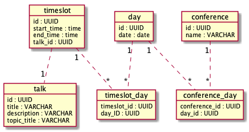

## Todo 
-[ ] Optimize import 
-[ ] Refaktorer HTTP-biten 
-[ ] Bytt til POST med data i body 
-[ ] Gå over alle Fixme's og todo's 
-[ ] Fjerne alle dependencies fra eksamen-pom
-[ ] Ha en index.html herokuapp.com/schedule som viser schedule rendret
-[ ] Gå gjennom ALLE klasser bit for bit og skriv forklarende doc for _alle_ klasser og noen metoder   
-[ ] Skrive javadoc
-[ ] client lytter etter kommandoer, behøver ikke kjøre java-jar hver gang (har en "prompt")
-[ ] sjekke warnings fra intellij
-[ ] Skrive om de største testene som integrasjonstester 

## Notater fra tog :D 
DaoTest.createDao() er lik i alle tester. Burde det være default-metode?


## Notes 
Refaktorering: 
Commands ligger i core -> client/server implementerer bare execute.
For at det skal fungere, må også client gi et map med eks. "title", "Tords toalettguide"
Dvs. at parsing i client fungerer litt som i første øving, men at argumenter parsers på forhånd.          

-[ ] wrapper-klasser rundt JSON som sier hva slags operasjon som ble gjort mm. 

## Todo tuesday
1. Argumentparser/inputparser-tester + sever og client test 
2. rydd i clientinserttalkcommand
3. TordTest, Olav JavaDoc + rydd  
4. "localhost" er hardkodet, ligge i proeprties-fil?
 


# Dokumentasjon 
Olav Sundfør - sunola17 <br>
Tord Jon - jontor17 <br>

- [Dokumentasjon](#dokumentasjon)
    - [Testing av løsning](#testing-av-l%C3%B8sning)
    - [Bruk av program](#bruk-av-program)
        - [Om programmet](#om-programmet)
        - [Vise programoversikt](#vise-programoversikt)
        - [Legge inn data](#legge-inn-data)
        - [Liste ut data](#liste-ut-data)
        - [Koble sammen data](#koble-sammen-data)
        - [Sletting](#sletting)
        - [Oppdatering](#oppdatering)
    - [Evaluering av samarbeid](#evaluering-av-samarbeid)
    - [Video](#video)
    - [Diagrammer](#diagrammer)
        - [Datamodell](#datamodell)
        - [DAO](#dao)
        - [Command](#command)
    - [Egenevaluering](#egenevaluering)


    - [X] Navn og Feide-ID på dere de som var på teamet
    - [ ] Inkluderer dokumentasjonen hvordan man tester ut funksjonaliteten programmet manuelt? (Inkludert eventuell ekstra funksjonalitet dere har tatt med)
    - [X] Inkluderer dokumentasjonen en evaluering av hvordan man jobbet sammen?
    - [X] Inkluderer dokumentasjonen en screencast av en parprogrammeringsesjon?
    - [ ] Inkluderer dokumentasjonen en evaluering *fra* en annen gruppe og en evaluering *til* en annen gruppe?
    - [ ] Inkluderer dokumentasjonen en UML diagram med datamodellen?
    - [X] Inkluderer dokumentasjonen en link til screencast av programmeringsesjon?
    - [ ] Inkluderer dokumentasjonen en egenevaluering med hvilken karakter gruppen mener de fortjener?

## Testing av løsning 

## Bruk av program  

### Om programmet 
Programmet vi har laget, lar brukeren holde orden på konferanser i en database. 
En konferanse ("conference") foregår over en eller flere dager. En dag ("day") kan ha 
flere tidsperioder ("tidsperionder").
På hver tidsperiode kan det være en eller flere foredrag. 

Data (konferanser, foredrag, dager, tidsperioder) legges inn av brukeren. 
De kan så kobles sammen slik brukeren ønsker. Beskrivelse av hvordan dette gjøres, finnes 
nedenfor, i denne seksjonen av dokumentet. 

### Vise programoversikt 
Viser et programmet for en hel konferanse, med alle relevante detaljer: 
`show schedule -id ID`, hvor ID kan finnes ved å kjøre `list conferences`'. ID er påkrevd. 

### Legge inn data
* Talk
    * `insert talk -title Java honey jars -description Really important talk! -topic java`
    * `insert talk`
        * `-title`
        * `-description `
        * `-topic`
* Conference 
    * `insert conference -name The Book Conference` 
    * `insert conference`
        * `-name`
* Day (DD.MM.YYYY)
    * `insert day -date 18.04.1999`
    * `insert day`
        * `-date` __required__
* Timeslot (HH:MM)
    * `insert timeslot -start 14:30 -end 15:45`
    * `insert timeslot`
        * `-start` __required__
        * `-end` __required__

### Liste ut data 
* `list talks`
* `list conferences`
* `list days`
* `list timeslots`

### Koble sammen data 
* Day og conference 
    * `connect day-with-conference -day DAYID -conference CONFERENCEID`
    * `connect day-with-conference`
        * `-day` __required__
        * `-timeslot` __required__
* Timeslot og Day 
    * `connect timeslot-with-day -timeslot TIMESLOTID -day DAYID`
    * `connect timeslot-with-day`
        * `-timeslot` __required__ 
        * `-day` __required__
* Talk og Timeslot 
    * `connect talk-with-timeslot -talk DAYID -timeslot CONFERENCEID`
    * `connect talk-with-timeslot`
        * `-talk` __required__ 
        * `-timeslot` __required__

### Sletting 
Kjør `delete`, det du vil slette og en ID. 
Du kan finne ID ved å kjøre `list`-kommandoen. 
* `delete talk -id ID`
* `delete conference -id ID`
* `delete day -id ID`
* `delete timeslot -id ID`

### Oppdatering 
* Talk
    * `udpate talk -title I had to update this -id ID`
    * `update talk`
        * `-id` __required__
        * `-title`
        * `-description `
        * `-topic`
* Conference 
    * `update conference -id ID -name Edited talk title` 
    * `update conference`
        * `-id` __required__
        * `-name`
* Day (DD.MM.YYYY)
    * `update day -date 18.04.1999`
    * `update day`
        * `-id` __required__
        * `-date`
* Timeslot (HH:MM)
    * `update timeslot -start 14:30 -end 15:45`
    * `update timeslot`
        * `-id` __required__
        * `-start`
        * `-end`


## Evaluering av samarbeid 
Vi har stort sett jobbet sammen, ofte på en maskin. Når vi ikke har gjort det, har vi jobbet over nett, med Git og samtaleverktøy som voicechats i Slack og Discord. Vi har også delt skjerm gjennom disse tjenestene og på den måten fått gjort en slags form for parprogrammering når vi har sett behov for det.

Hva samarbeidet angår, finner vi ofte gode løsninger. Det er ikke alltid vi er enige, men vi opplever at samtalen er konstruktiv, heller enn å være en konflikt. Vi har jevnt over funnet en god løsning som begge kan si seg fornøyde med, til tross for at ikke alle elementer er slik som hver av oss opprinnelig hadde sett for seg.

I arbeidskrav 2 skrev vi at vi har et forbedringspotensiale på det å sette konkrete mål for hva som skal gjøres, fremfor å jobbe sporadisk og hoppe mellom arbeidsoppgaver. Her har vi blitt flinkere. 
En teknikk vi har brukt er å sette opp konkrete lister over hva som må gjøres. 

## [Video](https://www.youtube.com/watch?v=3axZ6puyq0s&feature=youtu.be)

## Diagrammer 
### Datamodell


Datamodellen vår fungerer slik: <br> 
Systemet vårt skal holde rede på konferanser. Hver konferanse kan gå over ingen eller mange dager, gjennom en koblingstabell. Vi ønsker å tillate ingen dager fordi at man skal kunne registrere konferanser som enda ikke har fått datoer. 

En dag har flere tidsrom ("timeslots") hvor man potensielt kan legge inn et foredrag. 

### DAO


Vi har ønsket å vite at alle DAO-klasser har mulighet til å gjøre alle CRUD-operasjoner. Det de derfor har til felles er er metodesignaturer (med genererisk spesifisering) og mulighet til å kjøre SQL. 

De forskjellige implementasjonene arver fra den abstrakte klassen, og implementerer metodene. 

`executeSQL` er ikke abstrakt i `DAO`, og er implementert slik at koden i de konkrete klassene kan bli slik som dette: 
```java 
@Override
public List<Talk> retrieveAll() throws SQLException {
    String sql = "select id, title, description, topic_title from talk";
    List<Talk> results = executeSQL(sql, this::mapResultSet);

    return results;
}
``` 

`mapResultSet` er en metode som tar i mot resultatet fra en spørring og transformerer ("mapper") det til et objekt av typen vi er interessert i.
```java 
@Override
    protected Talk mapResultSet(ResultSet resultSet) throws SQLException {

            Talk talk = new Talk(
                    (UUID) resultSet.getObject(1),
                    resultSet.getString(2),
                    resultSet.getString(3),
                    resultSet.getString(4)
            );

        return talk;
    }
```

Notis: De konkrete klassenes generics er ment å vise: `class TalkDao extends Command<Talk>`

### Command

Kommandoer ("Commands") spiller en stor rolle i vår struktur. En kommando er en handling som programmet gjør, basert på et input. Et eksempel på en kommando er `InsertTalkCommand`. Den har som oppgave å legge inn et foredrag ("talk") i databasen. 

Kommandoer som denne har to sider:

1. Bruker forteller clienten at dette skal skje
2. Server utfører den faktiske operasjonen

Denne egenskapen (med to sider) gjelder alle kommandoer i programmet vårt. Derfor har alle kommandoer et felles sett med  abstrakte "base"-klasser i `Core`-modulen. 
`Server`- og `Client`-modulene har så konkrete implementasjoner av disse. (f.eks. `ServerInsertTalkCommand`og `ClientInserTalkCommand`)

Diagrammet viser strukturen for kommandoen som skal slette talks, men den samme strukturen gjenbrukes for alle kommandoer. 

Både på server- og klientside skal denne kommandoen opere med ID. De to skal altså bygges med de samme verdiene, og har en felles `build`-metode som arves fra Core. De skiller seg derimot i hva de skal _gjøre_. Derfor har de forskjellige `execute`-implementasjoner i Server og Client. 

Noe funksjonalitet gjelder for alle kommandoer på server, og kun disse.
Det samme gjelder funksjonalitet for kommandoer på Client. 

Denne funksjonaliteten hentes inn med de to interfacene. 

- [ ] evaluering av prosjektet 
- [ ] Hvilken karakter vi mener vi fortjener

## Egenevaluering
Vårt prosjekt har brukt noe av logikken fra tidligere arbeidskrav. Det gikk lettere å slå sammen de to prosjektene denne gangen, siden vi hadde gjort det tidligere. Vi tok plugins som _maven-shade-plugin_ og _jacoco_ med oss fra tidligere arbeidskrav. Under oppsettet kom nytten av å ha gjort det samme tidligere tydelig frem. 

Til forskjell fra tidligere oppgaver, har vi i den endelige innleveringen delt prosjektet opp i flere maven-moduler. 
Dette har gitt oss en mye bedre fordeling av oppgaver ("Separation of concerns") i programmet enn vi ellers ville hatt. 

Kommandoer -> Hvorfor god ide 

Tester -> forklare hvorfor store 


